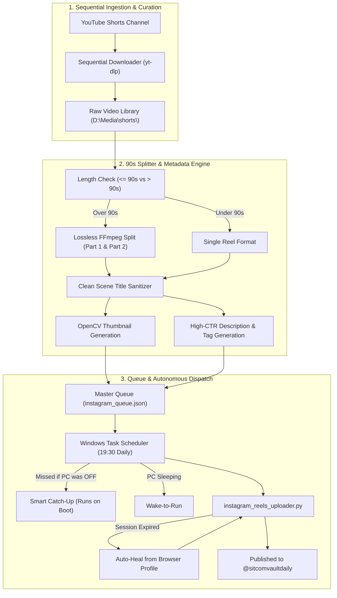

# Sitcom Vault Daily — Autonomous Instagram Reels & Shorts Pipeline

An end-to-end, fully automated video ingestion, processing, and publishing pipeline for **Instagram Reels** and **vertical Shorts**. 

Designed for high-throughput, multi-show sitcom syndication (The Big Bang Theory, How I Met Your Mother) with strict sequence preservation, Meta 90-second compliance splitting, automated thumbnail generation, and a resilient background scheduler with **missed-task catch-up** and **browser session auto-healing**.

---

## 🌟 Key Capabilities

### 1. 📥 Sequential Video Ingestion & Library Sync
* **Exact Upload Sequence Preservation**: Downloads channel libraries top-to-bottom in their exact original sequence using `yt-dlp`.
* **Multi-Show Support**: Manages separate content libraries (e.g., The Big Bang Theory, How I Met Your Mother) with structured manifests.
* **Human-Readable File Sanitizer**: Automatically cleans raw YouTube IDs into descriptive, human-readable scene titles across local disks and queue manifests.

### 2. ✂️ Meta 90-Second Reels Compliance Splitter
* **Lossless Stream Splitting**: Detects any video exceeding Meta's strict 90-second Reels limit and splits it into `Part 1` and `Part 2` using lossless FFmpeg stream copy (`-c copy`) without re-encoding quality loss.
* **Synchronized Multi-Part Captions**: Automatically generates paired cliffhanger descriptions, tags, and calls-to-action ("Part 2 drops tomorrow!").
* **OpenCV Thumbnail Extraction**: Grabs high-quality, high-expression video frames at key timestamps to serve as native Reel cover thumbnails.

### 3. ⏰ Autonomous Scheduling & Publishing Suite
* **Autonomous Daily Publishing**: Hands-free daily posting at 19:30 local time (customizable).
* **Smart Catch-Up & Wake Scheduling**:
  * **Missed-Run Catch-Up (`StartWhenAvailable = True`)**: If the laptop is shut down or powered off at the scheduled posting time, Windows Task Scheduler automatically runs the upload the moment the machine boots up next.
  * **Sleep Wake-Up (`WakeToRun = True`)**: Wakes the laptop from modern standby or sleep to execute scheduled uploads.
  * **Battery Support**: Seamless execution whether plugged into AC power or running on battery.
* **Browser Session Auto-Healing**: If the mobile API session ever flags `login_required`, the uploader automatically extracts and syncs fresh cookies from the persistent Playwright browser profile (`config/meta_suite_profile`) without interrupting you.
* **Centralized Master Queue**: Real-time state tracking in `instagram_queue.json` and CSV exports for Meta Business Suite Planner (`meta_schedule.csv`).

---

## 🏗️ Architecture & Workflow



---

## 📦 Repository Structure

```
├── config/
│   ├── instagram_session.json        # Active mobile API session
│   ├── meta_suite_profile/           # Playwright persistent Chrome profile for Meta
│   ├── run_daily_instagram_upload.bat# Windows Task Scheduler runner
│   ├── task_definition.xml           # Windows Task Scheduler configuration XML
│   └── .env.example                  # Environment variables template
├── scripts/
│   ├── instagram_reels_uploader.py   # Daily Instagram Reel dispatcher & queue processor
│   ├── upgrade_windows_task.py       # Configures Task Scheduler with catch-up & wake settings
│   ├── sync_and_download_diepvo.py   # Sequential YouTube channel downloader
│   ├── split_tbbt_into_90s_reels.py  # Lossless 90-second splitter for Reels compliance
│   ├── rename_shorts_to_title_names.py# Renames files from video IDs to scene titles
│   ├── generate_rich_descriptions.py # High-CTR captions & hashtag generator
│   ├── manage_profile_and_links.py   # Profile bio cleaner & link manager
│   ├── login_instagram_browser.py    # Playwright browser login & cookie extractor
│   └── schedule_meta_suite.py        # Meta Business Suite scheduling automations
├── requirements.txt                  # Python dependencies
└── README.md
```

---

## 🚀 Getting Started

### 1. Prerequisites
* **Python**: 3.10+ (tested on Python 3.12 - 3.14)
* **FFmpeg**: Must be available on system `PATH`
  * Windows: `winget install Gyan.FFmpeg`
  * macOS: `brew install ffmpeg`
  * Linux: `sudo apt install ffmpeg`

### 2. Installation
```powershell
# Clone the repository
git clone https://github.com/Chinmay468/Project_Delta.git
cd Project_Delta

# Install dependencies
pip install -r requirements.txt
```

---

## 🛠️ Usage Guide

### 1. Daily Instagram Reels Automation

#### Check Queue & Session Status
```powershell
python scripts/instagram_reels_uploader.py --status
```

#### Upload Next Queued Reel Manually
```powershell
python scripts/instagram_reels_uploader.py --post-next
```

#### Register / Upgrade Daily Scheduled Task
Sets up the Windows Scheduled Task to run daily at 19:30 with **Missed-Run Catch-Up** and **Wake-from-Sleep** enabled:
```powershell
python scripts/upgrade_windows_task.py
```

#### One-Click Browser Session Login
If Instagram requires a fresh login, open the persistent browser to capture cookies:
```powershell
python scripts/login_instagram_browser.py
```

---

### 2. Video Processing & Library Management

#### Download Shorts from a YouTube Channel in Order
```powershell
python scripts/sync_and_download_diepvo.py
```

#### Split Long Videos into 90s Reels (Lossless)
```powershell
python scripts/split_tbbt_into_90s_reels.py
```

#### Rename Raw Video IDs to Scene Titles
```powershell
python scripts/rename_shorts_to_title_names.py
```

#### Generate Rich Captions, Hooks & Hashtags
```powershell
python scripts/generate_rich_descriptions.py
```

---

## ⚙️ Configuration & Credentials

Copy `config/.env.example` to `config/.env`:
* `INSTAGRAM_USERNAME`: Account handle (e.g. `sitcomvaultdaily`)
* `INSTAGRAM_PASSWORD`: Account password (optional if using browser session)
* `INSTAGRAM_SESSIONID`: Browser session cookie (optional)

*All session tokens, browser storage states, and media directories are automatically excluded via `.gitignore`.*
